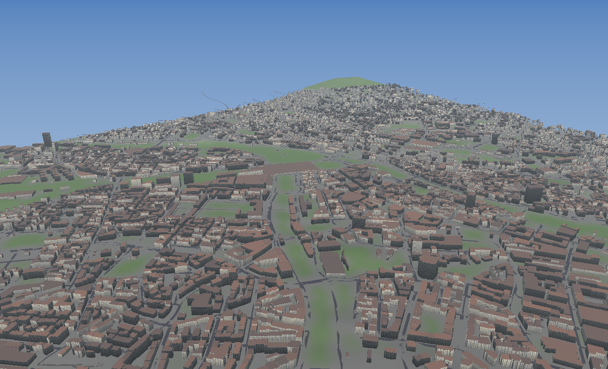
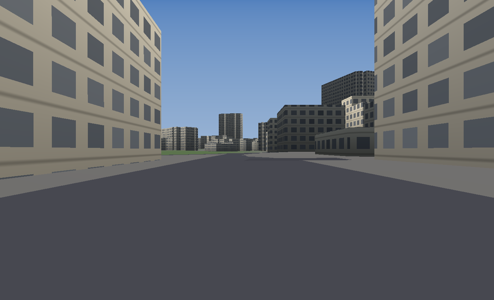
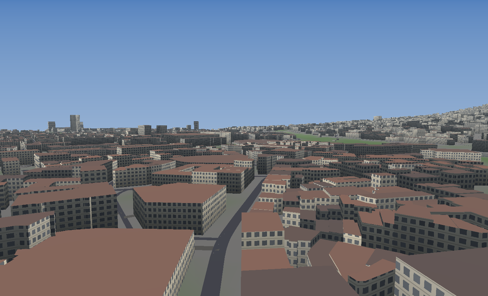

# Zurich, open world

A drivable 3D reconstruction of central Zurich built entirely from open data —
no hand modelling, no photogrammetry, no purchased assets.



Everything here is generated by running two Python scripts and a Swift renderer.
The city is **3.7 × 3.4 km**, **4,877 road edges**, **259 km of drivable road**,
**649 named streets**, **92 bridges** and **12,538 buildings** — about 400,000
triangles in total, small enough to hold in memory with no streaming or LOD.

| | |
|---|---|
|  |  |

## Where the data comes from

* **Roads** — OpenStreetMap centrelines, widths, one-ways and speed limits,
  fetched through the Swiss Overpass mirror `overpass.osm.ch`. (The main
  instance returns 504 under load often enough to be unusable.)
* **Terrain** — swisstopo **swissALTI3D**, sampled through the geo.admin height
  API in LV95 / EPSG:2056. The world spans 399–663 m: Lake Zurich up to the
  Zürichberg.
* **Buildings** — OpenStreetMap footprints, extruded. Of 12,586 buildings, 64
  carry an explicit height and 3,607 a storey count; the rest are estimated from
  type and footprint area.

Road data © OpenStreetMap contributors, [ODbL](https://opendatacommons.org/licenses/odbl/).
Terrain © swisstopo.

## Layout

```
tools/     the data pipeline (Python, no dependencies beyond the stdlib)
data/      the generated world — roads + terrain, and buildings
swift/     RoadNetwork.swift plus the Metal renderer and a test harness
images/    rendered stills
```

## Running it

Regenerate the world (takes ~90 s, mostly waiting on elevation samples):

```bash
cd tools && python3 zurich_world.py && python3 zurich_buildings.py
```

Drive it:

```bash
cd swift/zurichview && swift run -c release zurichview drive
```

`W`/`S` throttle and brake, `A`/`D` steer, `R` respawn, `Esc` quit.

Render stills headlessly instead:

```bash
cd swift/zurichview && swift run -c release zurichview
```

## How it plugs into the physics

The renderer is incidental. The point of `RoadNetwork` is that it conforms to
one protocol:

```swift
public protocol GroundProvider: AnyObject {
    func sampleGround(x: Double, z: Double) -> GroundSample
}
```

A vehicle simulation that talks to the world only through that method — asking
what is under each wheel — drives here unmodified. Tire model, suspension and
chassis need no changes at all. Ground queries run at about **11 M/s**, against
the ~240/s a four-wheel sim at 60 Hz actually needs.

The one thing the protocol cannot express is a flyover and the street beneath it,
because it carries no height. Zurich's bridges are nearly all over water or rail,
so it costs little here.

## Things OSM will do to you

Each of these silently produced broken geometry before it produced an error:

1. **Streets run past your area of interest.** Trim them where they meet their
   neighbours — which fixes their orientation for free.
2. **`highway=service` spurs share the street's name** and loop back on
   themselves, so any attempt to walk a street end to end derails into a car park.
3. **Pedestrian zones are closed-way plazas, not lines.** Walking one yields a
   kilometre of geometry that goes nowhere. Drop ways whose first node is their
   last.
4. **Removing those plazas leaves holes they were bridging**, so chains have to
   be rejoined geometrically afterwards.
5. **Bridges must not follow the terrain model.** Under the Limmat bridges the
   DEM returns the *water* surface, which sinks the road into the river.
   Interpolate the deck between its abutments.

And two that are about Swift and Metal rather than data:

6. **`SIMD3<Float>` has a stride of 16 bytes, not 12.** A Metal struct declared
   with `packed_float3` therefore reads every vertex at the wrong offset and
   renders confetti. There is a `precondition` on the vertex stride for this.
7. **`Int()` truncates toward zero.** Negative world coordinates turn a
   centre-plus-radius raster range into `lowerBound > upperBound`, which traps.

## Status

Working: the world, the road network as a `GroundProvider`, the Metal renderer
(terrain, roads, extruded buildings, procedural façades, hemispheric lighting,
distance fog), headless stills and an interactive window.

Not done yet: textures, shadows, real roof shapes, and the driving is a
placeholder rather than a real vehicle simulation.
